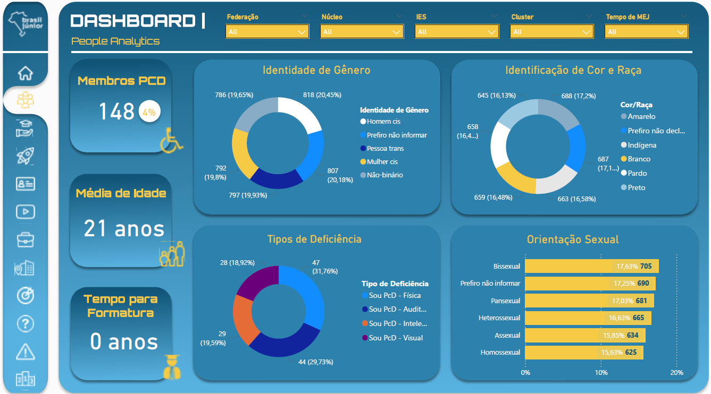

# Brasil Júnior Census Analytics - Power BI Dashboard

This dashboard was developed for **Brasil Júnior (BJ)**, the Confederation of Junior Enterprises in Brazil. 

The objective of the project is to process, analyze, and visualize nationwide census data collected from annual surveys administered to approximately 20,000 junior enterprises operating across more than 270 universities in Brazil.

Structured into **10 interactive pages**, the dashboard delivers end-to-end visibility into ecosystem performance, organizational health, financial drivers, and member engagement metrics.

> **Disclaimer regarding Data Privacy (LGPD/GDPR):** 
> To ensure compliance with the General Data Protection Law (LGPD) and confidentiality standards, **all data in this repository is 100% fictional**. The original dataset has been replaced with dummy data. No real information regarding any junior enterprise, university, or individual is disclosed.

## Key Modules

The dashboard provides analytical coverage across 10 report pages, including indicators such as:
- **People Analytics:** Monitoring member engagement, workload distribution, and team capacity.
- **Goal & Target Tracking:** Evaluating organizational performance and identifying the most challenging goals across different regions.
- **Revenue & Prospecting Channels:** Mapping key revenue drivers, such as Active Prospecting, Passive Prospecting, and Outsourcing/Subcontracting.
- **Partnerships & Strategic Alliances:** Analyzing key corporate partners and connections across the ecosystem.
- **Scores & Evaluations:** Aggregating survey ratings, satisfaction scores, and qualitative feedback across universities.

## Repository Structure
- `Brasil_Junior_Census_Dashboard.pbix`: Power BI report (using dummy data).
- `Data Dictionary.xlsx`: Comprehensive technical documentation listing all Calculated Columns and Measures, alongside their respective DAX formulas.

## Tech Stack
- **Power BI:** Data transformation (Power Query), relational data modeling, multi-page UI/UX design.
- **DAX:** Time intelligence
- **Excel:** Data dictionary and calculation reference.

## Dashboard Previews

### 1. People Analytics & Member Engagement

